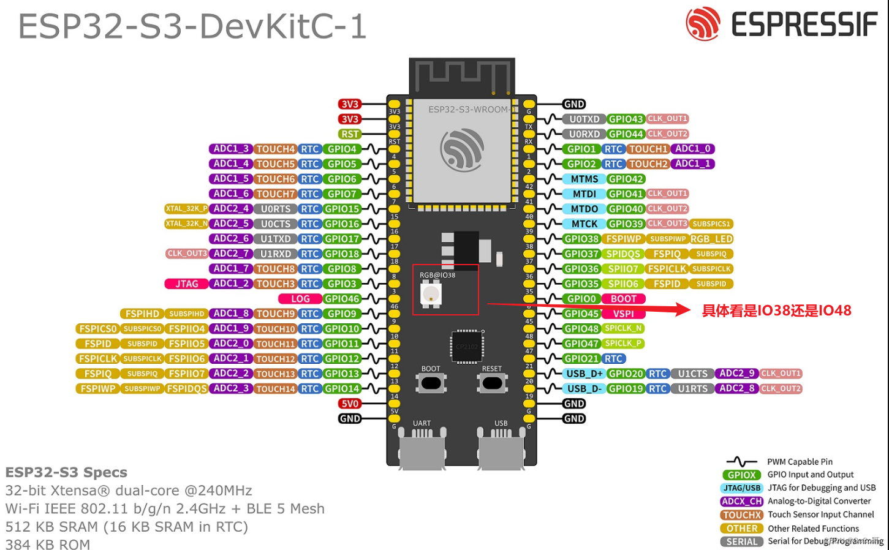

# Rust 嵌入式开发之 ESP32-S3

这是一个关于 ESP32-S3-R16N8 开发板学习案例，使用 Rust 语言的 STD 环境进行嵌入式开发。

注：

- 图片来源于网络。
- ESP32-S3-DevKitC-1 标记是 RGB@IO48 引脚。

## 示例目录

### 开门狗

- [x] [代码禁用开门狗](app/wdg/code_disable_wdg/README.md)
- [x] [SDK 配置禁用开门狗](app/wdg/sdkconfig_disable_wdg/README.md)

### 基础示例

- [x] [Hello World](app/basic/hello_world/README.md)
- [x] [日志级别](app/basic/log_level/README.md)
- [x] [LED 闪烁](app/basic/blinky/README.md)
- [x] [LED 流水灯](app/basic/led_flow_light/README.md)
- [x] [按钮](app/basic/button/README.md)
- [x] [按钮 Toggle](app/basic/button_toggle/README.md)
- [x] [按钮异步任务](app/basic/button_async/README.md)
- [x] [OLED 显示字符](app/basic/oled_show_str/README.md)
- [x] [蜂鸣器](app/basic/buzzer/README.md)
- [x] [对射式红外传感器控制蜂鸣器](app/basic/opposing_infrared_sensor_buzzer/README.md)
- [x] [光敏传感器控制蜂鸣器](app/basic/light_sensor_control_buzzer/README.md)

### 中断

- [x] [按键中断计次 1](app/interrupt/key_isr1/README.md)
- [x] [按键中断计次 2](app/interrupt/key_isr2/README.md)
- [x] [按键中断计次 3](app/interrupt/key_isr3/README.md)
- [x] [对射式红外传感器中断计次](app/interrupt/opposing_infrared_sensor_count/README.md)
- [x] [按键中断控制 LED 闪烁](app/interrupt/button_isr/README.md)
- [x] [旋转编码器计次](app/interrupt/rotary_encoder_count/README.md)
- [x] [定时器告警中断](app/interrupt/timer_alarm_isr/README.md)
- [x] [定时器通知](app/interrupt/timer_notify/README.md)
- [ ] [定时器外部时钟](app/interrupt/timer_external_clock/README.md)
- [ ] [RTC 中断](app/interrupt/rtc_isr/README.md)
- [ ] [RTC 外部时钟](app/interrupt/rtc_gpio/README.md)

### LEDC&PWM

- [x] [LEDC 简单示例](app/ledc/ledc_simple/README.md)
- [x] [LEDC 多线程](app/ledc/ledc_threads/README.md)
- [x] [PWM 驱动舵机](app/ledc/pwm_driven_servo/README.md)
- [x] [PWM 驱动直流电机](app/ledc/pwm_driven_motor/README.md)

### RMT

- [x] [RMT 收发器](app/rmt/rmt_transceiver/README.md)
- [x] [蜂鸣器播放歌曲](app/rmt/rmt_musical_buzzer/README.md)
- [x] [发送摩尔斯电码](app/rmt/rmt_morse_code/README.md)

### 编码器

- [x] [旋转编码器计数](app/encoder/rotary_encoder/README.md)
- [x] [旋转编码器接口延时测速](app/encoder/rotary_encoder_speed/README.md)

### 硬件

- [x] [查看内存大小](app/hardware/hardware_memory_size/README.md)
- [x] [RGB LED 闪烁](app/hardware/hardware_rgb_led/README.md)
- [x] [RGB LED 灯珠闪烁](app/hardware/hardware_multiple_rgb_led/README.md)

### 延迟

- [x] [FreeRtos 延迟](app/delay/freertos_delay/README.md)
- [x] [定时器延迟](app/delay/async_timer_delay/README.md)

### ADC

- [x] [ADC](app/adc/adc/README.md)
- [x] [adc oneshot](app/adc/adc_oneshot/README.md)
- [x] [3D 摇杆电位器](app/adc/joystick_potentiometer_3d/README.md)
- [x] [电位器读取电压](app/adc/potentiometer_reading_voltage/README.md)
- [x] [多通道读取数据](app/adc/ad_multichannel/README.md)

### I2C

- [x] [软件读写 MPU6050](app/i2c/i2c_soft_mpu6050/README.md)
- [x] [硬件读写 MPU6050](app/i2c/i2c_hard_mpu6050/README.md)
- [x] [MPU6050 crate](app/i2c/i2c_mpu6050_crate/README.md)

### SPI

### C 绑定

- [x] [FFI Hello](app/ffi/ffi_hello/README.md)
- [ ] [Bindgen Hello](app/ffi/bindgen_hello/README.md)

### 组件库

- [x] [neopixel RGB LED](core/neopixel/README.md)
- [x] [OLED 显示屏](core/oled/README.md)
- [x] [PCNT 解码旋转编码器](core/pcnt_encoder/README.md)
- [x] [I2C MPU6050](core/mpu6050/README.md)
- [ ] [SPI W25Q64](core/w25q64/README.md)
- [ ] [esp32s3-nrf24l01](core/esp32s3-nrf24l01/README.md)

## 其他示例库

- [网络相关 esp-idf-svc](https://github.com/esp-rs/esp-idf-svc/tree/master/examples)
- [IDF HAL 库相关 esp-idf-hal](https://github.com/esp-rs/esp-idf-hal/tree/master/examples)
- [NO_STD HAL 库培训材料](https://github.com/esp-rs/no_std-training/blob/main/README.md)
- [STD HAL 库培训材料](https://github.com/esp-rs/std-training/blob/main/README.md)

## 项目文档

- [Archlinux 环境搭建](./docs/Archlinux环境搭建.md)
- [esp-idf 环境配置](./docs/esp-idf环境配置.md)
- [问题答疑 Q&A](./docs/问题答疑Q&A.md)

## 参考文档

- [The Rust on ESP Book 简体中文版](https://narukara.github.io/rust-on-esp-book-zh-cn/introduction.html)
- [ESP32-S3 系列芯片介绍](https://blog.csdn.net/MJiarong_personal/article/details/121726585)
- [esp-idf C 绑定参考](https://esp-rs.github.io/esp-idf-svc/esp_idf_svc/index.html)
