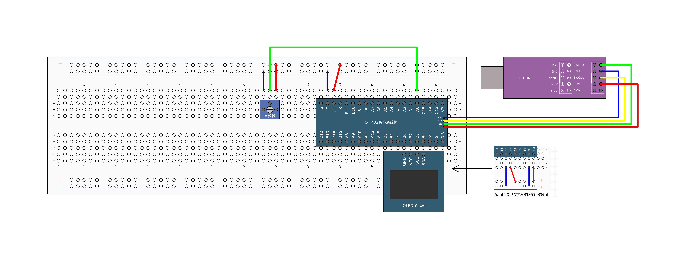

# 电位器读取电压

电位器是一种可以调节电阻值的电子元件，它通常有三个引脚，分别是两个固定引脚和一个滑动引脚。固定引脚是电阻体的两端，滑动引脚是电刷，它可以在电阻体上移动，改变输出电压或电阻值。电位器既可以作为三端元件，也可以作为二端元件使用。

## 引脚

### 电位器

注：定位点为左下角。

- 端子 1（A）：电阻体的一端，通常接外加电压的正极或信号输入端。
- 端子 2（B）：电阻体的另一端，通常接外加电压的负极或信号输出端。
- 滑动引脚（W）：电刷，可以在电阻体上滑动，输出与滑动位置成一定关系的电压或电阻值。

## 图示



## 执行指令

```shell
cargo run -r -p potentiometer_reading_voltage
```
