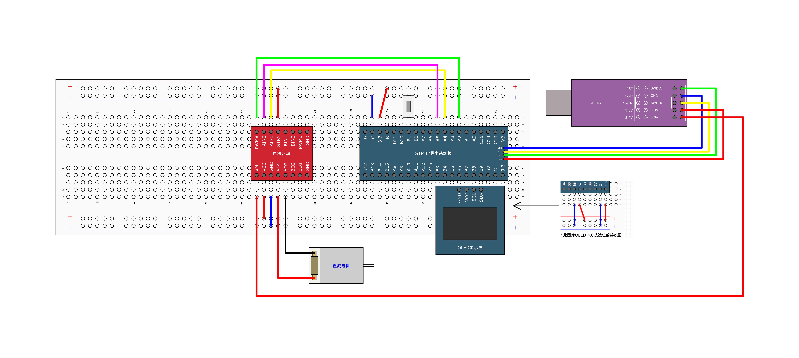

# PWM 驱动直流电机

## 引脚

### 按钮

- 一端: GND
- 一端: IO4

### 电机驱动 TB6612FNG

- PWMA: IO5
- AN1: IO6
- AN2: IO7
- STBY: VCC
- VM: VCC 5V
- VCC: VCC
- GND: GND
- AO1: 电机正极
- AO2: 电机负极

### 电机

- 正极: TB6612FNG-AO1
- 负极: TB6612FNG-AO2

## 图示



## 执行指令

```shell
cargo run -r -p pwm_driven_motor
```
