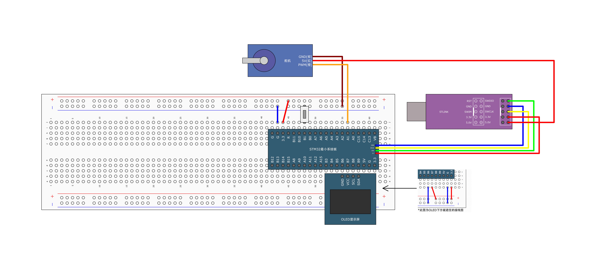

# PWM 驱动舵机

这是一个使用 PWM 驱动舵机的示例。主要展示控制舵机旋转角度，以及旋转角度计算。

舵机的控制一般需要一个 20Ms 左右的时基脉冲，该脉冲的高电平部分一般为 0.5Ms~2.5Ms 范围内的角度控制脉冲部分，总间隔为 2Ms。

注： 这是一个失败的示例。

## 公式介绍

- PWM 信号的总周期和频率之间的关系，T 是总周期，f 是频率

```text
T=1/f
```

- 如果您想要设置总周期为 20ms，那么您需要设置频率为 50Hz:

```text
f=1/T=1s/0.02s=50Hz
```

- 以 180° 舵机为例，对应的控制关系如下：

```text
angle = (duty/max_duty)*180
```

## 引脚

### 舵机 SG90

- GND(棕): GND
- VCC(红): VCC 5V
- PWM(橙): IO5

### 按钮

- 一端: GND
- 一端: IO4

## 图示



## 执行指令

```shell
cargo run -r -p pwm_driven_servo
```
