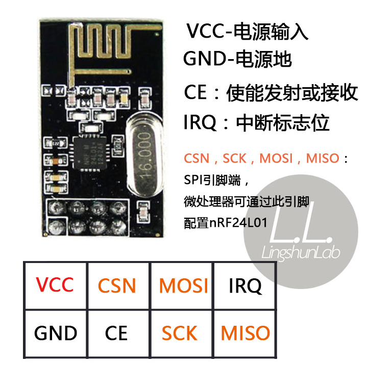

# NRF24L01

这是一个使用 NRF24L01 SPI 2.4 GHz 无线通信的示例。

注意：这是一个失败的示例，NRF24L01 配对失败。

## 引脚

### NRF24L01

- VCC: VCC
- GND: GND
- CSN: IO8
- CE: IO7
- MOSI: IO6
- SCLK: IO4
- MISO: IO5

## 执行指令

```shell
cargo run -r -p spi_nrf24l01
```

## 接线图


